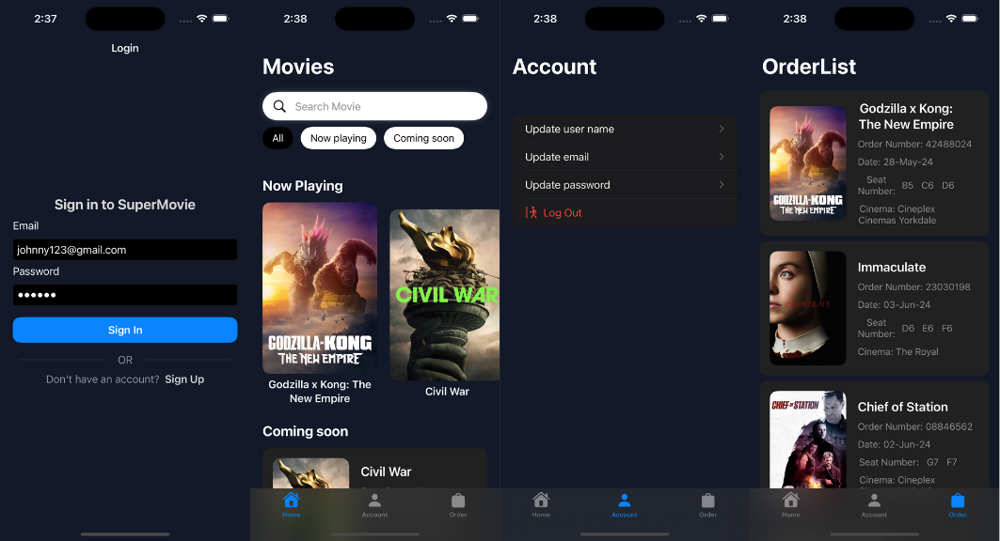

# SuperMovie

SuperMovie is an application that uses the TMDB API and is built with SwiftUI.

## Getting started
If you want to fetch the movie data from API, you'll need an API key from 
[TMDB](https://www.visualcrossing.com/](https://www.themoviedb.org/ ).  
 Once you get a key:  

1. Go to the `NetworkManager` file 
2. Replace `let apiKey = "API_KEY"` by your key
3. Create a project from Firebase
4. Download and insert the `GoogleService-Info` doc into the root folder
   
 Application requires Xcode 15.0 and iOS 16.0.

## Screenshots

 

## Demo

https://github.com/Johnny-1211/IOS-MovieApp/assets/71998280/bf5731dc-3060-4471-8770-ef8b42fc3379

## Built With

- [Swift](https://developer.apple.com/swift/) - Programming language used
- [Swift UI](https://developer.apple.com/documentation/swiftui/) - Creating user interfaces
- [UIKit](https://developer.apple.com/documentation/uikit) - For API fetching
- [FireStore](https://developer.apple.com/documentation/mapkit/](https://firebase.google.com/docs/firestore/quickstart ) - Saving and retrieve the data of user and data of movie 
- [FirebaseAuth](https://firebase.google.com/docs/auth) - Authenticate users with their email addresses and passwords

## Architecture

The project follows the MVVM (Model-View-ViewModel) architecture pattern. It separates the user interface from the business logic and backend data, making the codebase more modular, testable, and maintainable.

## License
This project is licensed under the [MIT](https://choosealicense.com/licenses/mit/)
